  

  &nbsp;
  &nbsp;
  

## 🪙 About me

When I started working in tech, I often felt like I was building things *just for the shelves*: projects that never really saw the light of day. At **[Kettner Edelmetalle](https://www.kettner-edelmetalle.de/)** it's the opposite. We combine e-commerce with livestream selling to open up gold investing to everyone in Germany, not just the wealthy or well-connected.

While savings in the bank lose value to inflation day by day, gold has protected wealth for thousands of years. It's not just an investment, it's financial insurance for your family's future. When a young parent tells us *"Now I know my children's future is protected"*, or a retiree says *"Finally, I can sleep peacefully knowing my savings are safe from inflation"*, that's what drives me.

> **We're not just selling gold. We're delivering peace of mind.**

## 🏦 What I'm building

<table>
  <tr>
    <td width="33%" valign="top">
      <h4>📺 Live shopping at scale</h4>
      Teleshopping-style livestreams where up to <b>30,000 people</b> discover gold at the same time. Live chat, reactions and prices, all in real time.
    </td>
    <td width="33%" valign="top">
      <h4>🪙 Gold savings plan</h4>
      Start with <b>€10 a month</b> and build up real, physical gold. Once you hit the threshold, we ship you an actual coin or store it securely for you.
    </td>
    <td width="33%" valign="top">
      <h4>🌍 Beyond Germany</h4>
      Making the platform multilingual, so Kettner can protect savings far beyond Germany.
    </td>
  </tr>
</table>

  <b>Excited about making investing easier, safer and truly global?</b> 
  We're taking Kettner beyond Germany, and I'd love to talk.  
  

## 🧭 How I got here

<b>The longer story</b>

 

At 13 I was hooked on Arma 3. By 14, my friends and I wanted our own game server, so someone had to figure out how to build it. I dove into forums, taught myself to code and soon realized I loved building even more than playing. We turned that server into our first SaaS business, selling subscriptions inside the game. I guess that entrepreneurial spark never left.

My path wasn't exactly traditional. After working for startups during high school, I tried a work-study college program, but dropped out within weeks. The tech world was simply moving too fast, and German universities weren't keeping up. I already had four years of full-time experience and no time to wait, so I moved on, learning by doing.

## 🛠️ Tech I ship with

<table align="center">
  <tr>
    <th>Backend</th>
    <th>Frontend</th>
    <th>Infrastructure</th>
  </tr>
  <tr>
    <td align="center"></td>
    <td align="center"></td>
    <td align="center"></td>
  </tr>
</table>

  AI pair programmers I work with every day 
  &nbsp;
  

## 📈 By the numbers

  
  

  

Most of my code lives in private repositories. The contribution numbers include it, the language chart only sees public code.

<picture>
  <source media="(prefers-color-scheme: dark)" srcset="https://raw.githubusercontent.com/Cosnavel/Cosnavel/output/snake-dark.svg">
  <source media="(prefers-color-scheme: light)" srcset="https://raw.githubusercontent.com/Cosnavel/Cosnavel/output/snake-light.svg">
  
</picture>

## 📦 Open source & teaching

  

✍️ I also wrote the Laravel courses **Einstieg in Laravel**, **Laravel für Fortgeschrittene** and **Test Driven Laravel** for the [Webmasters Fernakademie](https://www.webmasters-fernakademie.de/weiterbildung/php-laravel).

## ⚡ Off the clock

- 🤖 **On AI:** I code with it every day. People talk about the 10x developer. I think if you're good with AI, you can be a **100x developer**.
- 🌲 **Outside of work:** out in the forest, hiking and hunting.
- 📺 **Watching:** [Fireship](https://www.youtube.com/@Fireship) for code tutorials and tech news.
- ☕ **Fun fact:** I love `c[_]`

## 💡 Advice for young developers

> Coding isn't the whole job anymore. AI will eventually write better code than any of us. What matters now is understanding the human impact: being the person who imagines how technology can genuinely improve lives.
>
> Instead of job hopping, stay and work towards a mission. When you're working toward something bigger than yourself, like protecting people's futures, it carries you through any challenge and truly advances your career.

  Thanks for stopping by. Let's build financial futures together.

